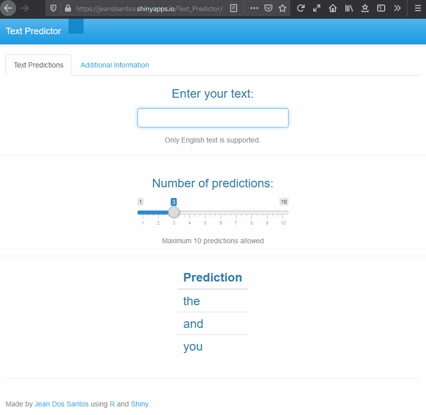

# Word Prediction

A simple app for text prediction and auto-completion. Predictions are obtained by calculating term frequency for 4-, 3-, 2- and 1-Grams. Predictions are assisted with Back-off.

To access the app go to [https://jeandsantos.shinyapps.io/Text_Predictor/](https://jeandsantos.shinyapps.io/Word_Predictor/)

To access a short report on the exploratory data analysis performed go to [https://rpubs.com/jeandsantos88/Swiftkey_Word_Predictor](https://rpubs.com/jeandsantos88/Swiftkey_Word_Predictor).

***
## Reproducing the environment

You can reproduce the environment by using the [`renv`](https://rstudio.github.io/renv/) package and the `renv.lock` file available in this repo.

***

## Questions and Feedback

For questions or feedback please contact me via [LinkedIn](https://www.linkedin.com/in/jeandsantos/) or [email](mailto:jeandsantos88@gmail.com?subject=Text%20Predictor%3A%20Questions%20and%20Requests).

For fixes or new feature request feel free to raise an issue.
